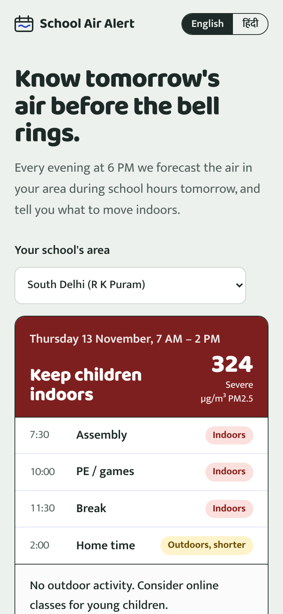
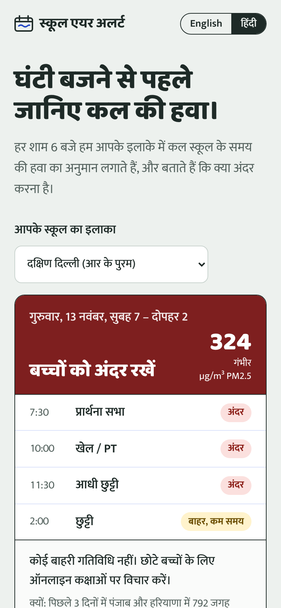
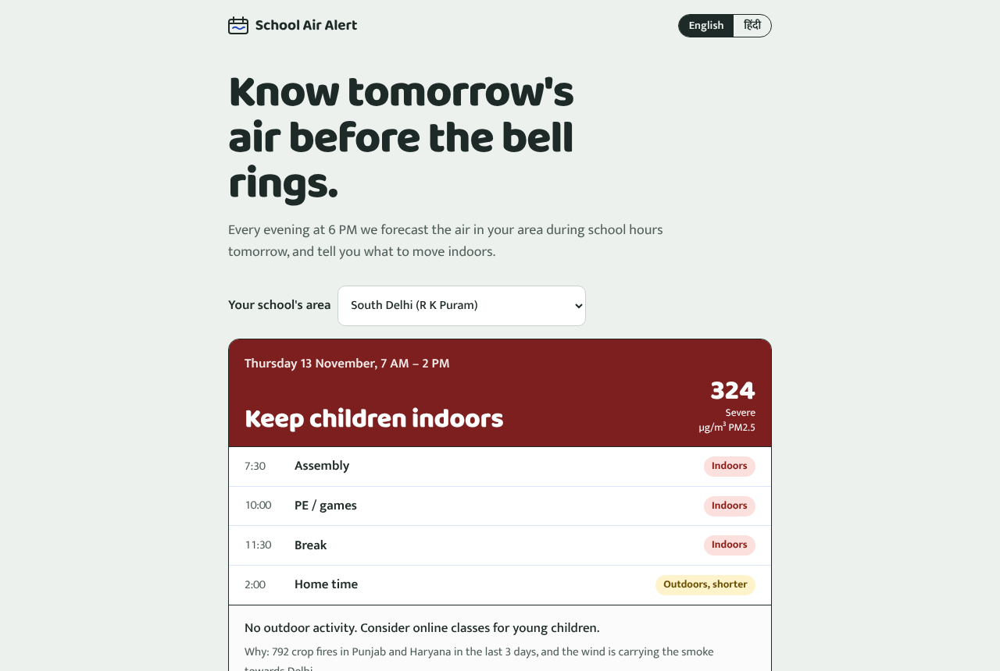
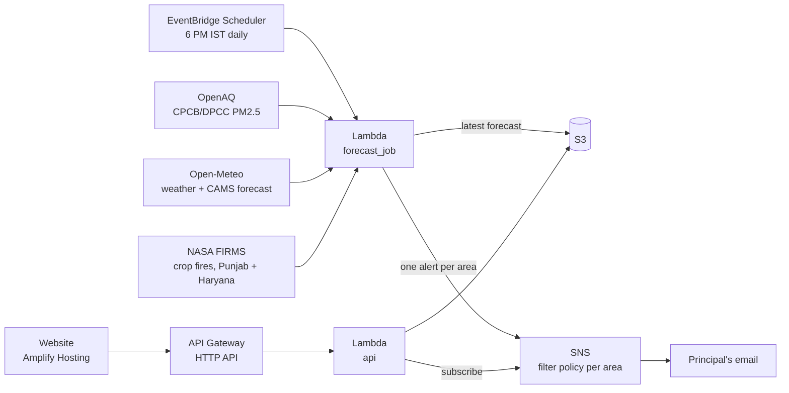

# School Air Alert

**Know tomorrow's air before the bell rings.**

Every evening at 6 PM, School Air Alert forecasts PM2.5 in Delhi during school hours the
next day (7 AM to 2 PM). It tells principals, in Hindi or English, whether assembly, PE
and break can stay outdoors.

**[Open the live site](https://main.d3a50vkyiccbtm.amplifyapp.com)** · **[See a Severe-day example](https://main.d3a50vkyiccbtm.amplifyapp.com/?demo=1)**

Built for the **Air track** of WeMakeDevs × AWS *Environmental Hacks*, part of the Bharat
Builds Tour 2026.

<table>
  <tr>
    <td width="33%"></td>
    <td width="33%"></td>
    <td></td>
  </tr>
  <tr>
    <td align="center">A Severe day</td>
    <td align="center">हिंदी</td>
    <td align="center">Laptop</td>
  </tr>
</table>

---

## The problem

Schools usually decide on outdoor activity on the morning itself, or by looking out of the
window. AQI apps show the air right now, or a global model forecast that misses Delhi's
worst days. By the time the air is visibly bad, children are already at assembly.

## What it does

- **Forecasts the one window that matters.** The average PM2.5 during school hours
  tomorrow, for 6 areas of Delhi, issued at 6 PM the day before.
- **Turns the number into a decision.** Tomorrow's school day is shown as a timetable:
  assembly, PE, break and home time, each marked *outdoors*, *outdoors but shorter* or
  *indoors*, following India's National Air Quality Index (NAQI) bands.
- **Sends it to the people who decide.** Principals sign up for their area and get one
  short email every evening, with the reason when there is one (for example, crop fires
  in Punjab plus north-west winds).
- **Works in Hindi and English,** on a phone.

## Results

The model was tested with blocked cross-validation by month. Each month was forecast by a
model that never saw that month or the 7 days either side of it. The data covers 2,325
station-days across 6 Delhi monitors, from Feb 2025 to Oct 2026.

| Forecast for tomorrow's school hours | Average error (µg/m³) | Right NAQI category | Bad days warned about (> 120) | Warnings that were right |
|---|---|---|---|---|
| **School Air Alert** | **19.3** | **59%** | **74%** | **80%** |
| Assuming tomorrow = today | 24.8 | 52% | 70% | 70% |
| CAMS global model | 49.3 | 28% | 22% | 26% |

**In the stubble-burning and winter season (Oct–Jan),** School Air Alert warned about
**88%** of Very Poor and Severe school days the evening before. The CAMS global model
warned about **30%**.

**Example.** On the evening of 12 Nov 2025 it would have forecast *Severe* air for the
next school day at Alipur, Anand Vihar and R K Puram (334, 327 and 324 µg/m³). The
monitors measured 319, 353 and 342.

**Limitations**
- When testing on past days, the "tomorrow's weather" inputs were the weather that actually
  happened, but the live system only has a forecast. Re-testing with realistic forecast
  errors added moved the average error from 19.3 to 19.8.
- There is only one stubble-burning season in the data. Satellite fire counts did not
  measurably improve accuracy, so they are used to explain *why* a day will be bad, not as
  a claimed accuracy gain.
- Three areas use the nearest working monitor, and the site names that monitor (for
  example "North Delhi (Alipur monitor)").
- Some DPCC monitors reach OpenAQ more than a day late. When an area's monitor is more than
  6 hours behind, the forecast switches to the nearest real-time monitor that tracks it
  well (correlation of at least 0.6 over the last 30 days), calibrated to the main
  monitor's level, and the site says which monitor was used. If no nearby monitor tracks
  it that well, the area shows "data unavailable" rather than a guess
  (`scripts/find_backups.py`).

## How it works



- **Model:** LightGBM, trained on log PM2.5. The inputs are PM2.5 so far today, last 6 hours,
  yesterday and the last 7 days; tomorrow's school-hours wind, boundary-layer height,
  humidity, temperature and rain; tonight's boundary layer and wind; fire counts and
  north-west wind; the CAMS forecast; and the season.
- **Serving:** the 600 trees are exported to JSON and run by a small plain-Python
  predictor (`backend/predictor.py`). It matches LightGBM to 12 decimal places, so the
  Lambda needs no ML libraries.
- **One feature pipeline:** training and the live Lambda call the same code
  (`backend/features.py`), so the live inputs are computed exactly as in training.
- **AWS:** Lambda, EventBridge Scheduler, S3, SNS, API Gateway and Amplify Hosting. The
  backend is defined in `template.yaml` and deployed with the **AWS SAM CLI**, an AWS
  open-source tool.

## Repository

| Path | What it is |
|---|---|
| `scripts/fetch_data.py` | Downloads about 2 years of PM2.5, weather, CAMS and fire data |
| `backend/features.py` | Feature engineering, shared by training and Lambda |
| `model/build_dataset.py` | Builds one row per station per day |
| `model/train.py` | Trains the model, runs cross-validation, writes `model/metrics.json` |
| `backend/predictor.py` | Runs the model in plain Python |
| `backend/forecast_job.py` | The daily 6 PM Lambda |
| `backend/api.py` | Website API: `/forecast`, `/stations`, `/subscribe` |
| `template.yaml` | Backend AWS infrastructure (SAM) |
| `frontend/index.html` | The website: one file, no build step |
| `scripts/publish_site.sh` | Publishes the website on AWS Amplify Hosting |

## Run it yourself

```bash
pip install requests pandas lightgbm scikit-learn
export OPENAQ_API_KEY=...   # free at explore.openaq.org
export FIRMS_MAP_KEY=...    # free at firms.modaps.eosdis.nasa.gov/api/map_key
python scripts/fetch_data.py               # data
python model/build_dataset.py              # features
python model/train.py                      # train + evaluate
python backend/forecast_job.py --dry-run   # tonight's real forecast, printed (sends nothing)
```

### Deploy

```bash
sam build
sam deploy --stack-name school-air-alert --region ap-south-1 --resolve-s3 \
  --capabilities CAPABILITY_IAM \
  --parameter-overrides OpenAqApiKey=... FirmsMapKey=...
bash scripts/publish_site.sh
```

## Data sources

- **PM2.5:** CPCB and DPCC monitors, via [OpenAQ](https://openaq.org).
- **Weather and CAMS forecast:** [Open-Meteo](https://open-meteo.com).
- **Crop fires:** [NASA FIRMS](https://firms.modaps.eosdis.nasa.gov) (VIIRS).
- **Categories:** India's National Air Quality Index PM2.5 bands.

## License

MIT. See [LICENSE](LICENSE).
